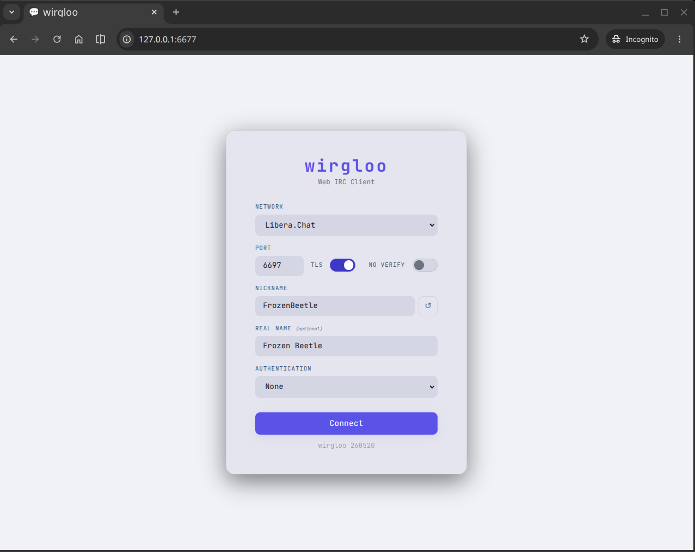
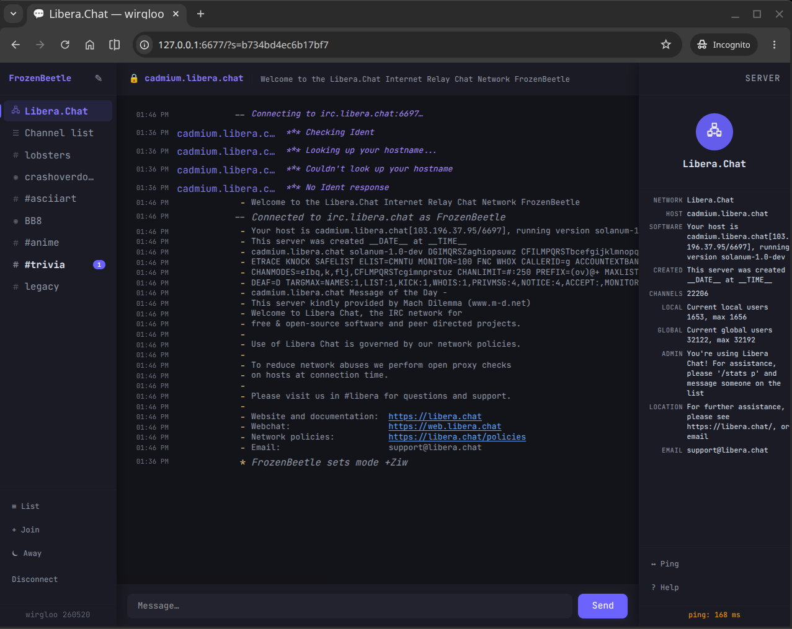
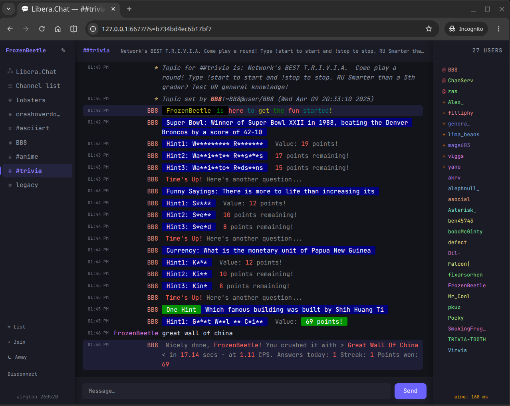
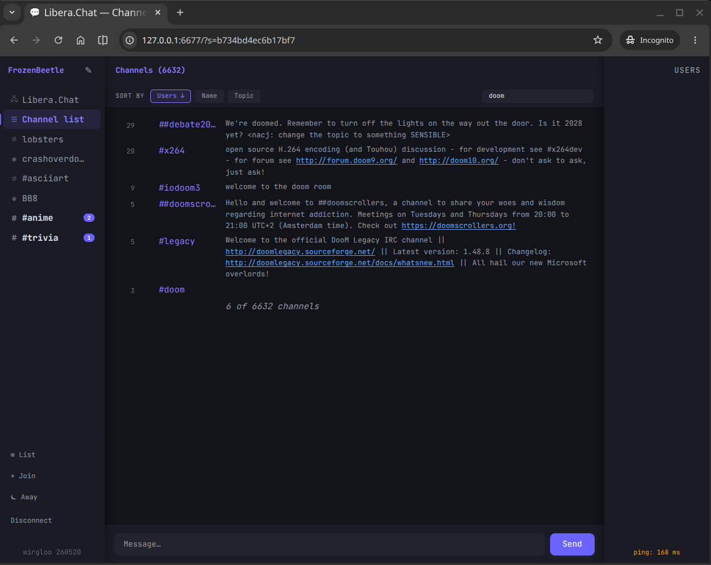
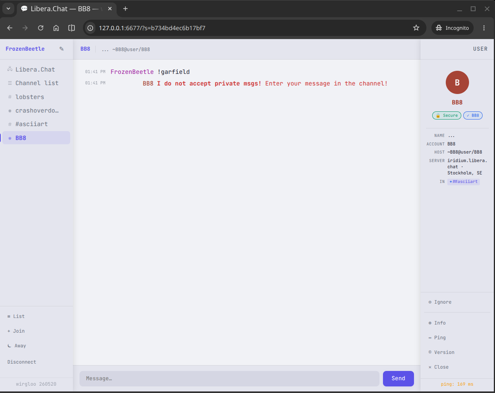
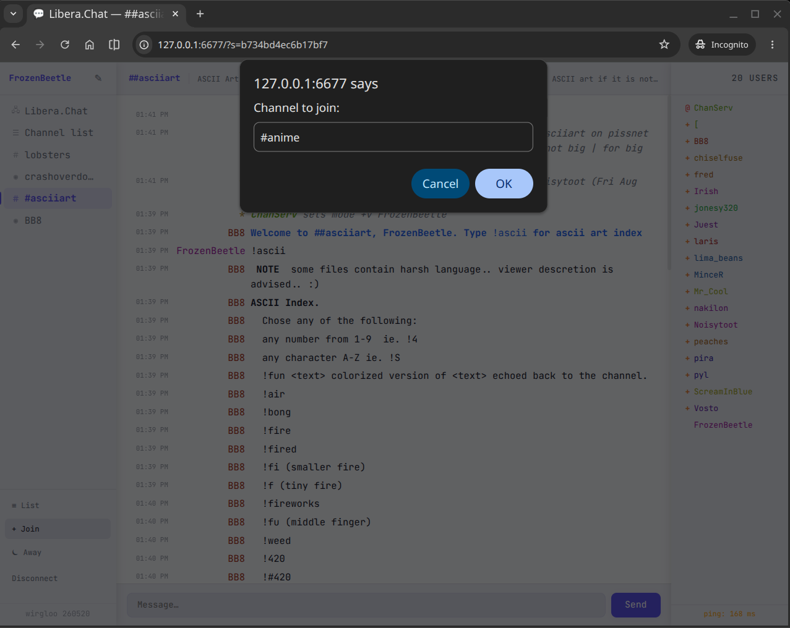

# wirgloo

> Self-hosted IRC client in your browser — single Go binary, no dependencies.


[](https://goreportcard.com/report/github.com/cstroie/wirgloo)

`scp` the binary to any server, run it, and IRC from any browser — no Node.js, no Docker, no build pipeline, no database. One process, one port.

## Screenshots

| Connect (light) | Connect (dark) |
|---|---|
|  |  |

| Channel chat | Channel list with filter |
|---|---|
|  |  |

| Direct message & user card | Join channel dialog |
|---|---|
|  |  |

---

## Why wirgloo?

Most web IRC clients require a stack: a Node process, a database, a reverse proxy, npm dependencies to keep updated. Wirgloo is a single statically-linked Go binary that embeds the entire UI. Drop it on a $5 VPS, point a browser at it, done.

- **Persistent sessions** — your IRC connection stays alive when the browser tab closes or the network drops. Reconnect within 30 minutes (configurable) and resume right where you left off.
- **Zero client dependencies** — plain HTML/CSS/JS, no framework, no bundler. Works in any modern browser.
- **One binary** — static files are baked in at build time. Copy and run.

---

## Features

**Connectivity**
- TLS and plain IRC, optional certificate verification bypass (for self-signed certs)
- Predefined network presets: Libera.Chat, OFTC, Rizon, EFnet, QuakeNet, DALnet, Undernet, IRCnet, GeekShed, RadioChat, SDF
- Custom server profiles saved to browser localStorage; network name (from server 005) stored after first connect and shown in the dropdown
- WebSocket reconnection with exponential backoff — IRC session survives brief network drops
- Transparent reconnect after server restart: channels re-joined, messages preserved
- Offline channel placeholders in the sidebar — click to rejoin

**Authentication**
- SASL PLAIN (full CAP negotiation)
- NickServ IDENTIFY (PRIVMSG and NICKSERV command variants)
- Server password (PASS)

**Channels & messaging**
- Channels, private messages, `/me` actions
- IRC formatting codes (bold, italic, underline, colour, monospace)
- Markdown-lite rendering (headings, bold, italic, strikethrough, inline code)
- Nick mentions highlighted in their assigned colour
- Chat log persisted per server/channel in IndexedDB (up to `logMax` messages, default 500), replayed on reconnect with a session-break marker
- Join/part/quit/kick events with directional arrows (`→` / `←`)

**User list**
- IRCv3 `multi-prefix` CAP — all privilege levels shown per nick
- Prefix symbols coloured by role: `~` owner · `&` admin · `@` op · `%` half-op · `+` voice
- Server `PREFIX` (005) parsed at connect time — adapts to any IRCd

**WHOIS & DMs**
- WHOIS fetched automatically when opening a DM or when someone messages you first
- User info card: real name, host, server, idle time, channels with prefix badges
- Identity badges: 🔒 Secure · ✓ Identified · ⚡ IRCop · 🤖 Bot · ⏾ Away

**Channel list (`/list`)**
- Top 50 channels by user count shown immediately; type to filter by name or topic (filtered server-side, no re-request)
- Sortable by name, user count, or topic
- Click any entry to join directly

**Commands**
`/join` `/part` `/msg` `/me` `/nick` `/topic` `/kick` `/ban` `/mode`
`/invite` `/notice` `/whois` `/ping` `/slap` `/ignore` `/unignore`
`/list` `/clear` `/help` `/raw`

**UI**
- Auto light/dark theme via `prefers-color-scheme`
- JetBrains Mono font
- Nick colours derived from a hash (consistent across sessions)
- Rate-limited outbound IRC (token bucket, 3 lines/sec)

---

## Quick start

**Download a release** from the [releases page](https://github.com/cstroie/wirgloo/releases):

```sh
# Linux (amd64)
curl -L https://github.com/cstroie/wirgloo/releases/latest/download/wirgloo-linux-amd64 -o wirgloo
chmod +x wirgloo
./wirgloo   # open http://localhost:6677
```

Replace `linux-amd64` with `linux-arm64`, `darwin-amd64`, `darwin-arm64`, or `windows-amd64.exe` as needed.

Linux binaries are statically linked (`CGO_ENABLED=0`) — they run on any distro, including Alpine and other musl-based systems, with no glibc dependency.

**Build from source** — requires Go 1.21+:

```sh
git clone https://github.com/cstroie/wirgloo
cd wirgloo
make          # builds ./wirgloo
./wirgloo     # open http://localhost:6677
```

---

## Deployment

### Systemd (recommended)

```sh
make install-service   # installs binary + systemd unit, reloads systemd
systemctl enable --now wirgloo
```

`PREFIX` and `SYSTEMD_DIR` are overridable:

```sh
make install-service PREFIX=/opt/wirgloo SYSTEMD_DIR=/etc/systemd/system
```

To remove:

```sh
make uninstall   # stops service, removes unit and binary
```

### Manual install

```sh
make install   # installs binary to /usr/local/bin
wirgloo -addr :6677
```

### Reverse proxy

Wirgloo binds to a single port and serves both HTTP and WebSocket on the same connection — no special proxy configuration needed beyond a standard `proxy_pass`. Example nginx snippet:

```nginx
location / {
    proxy_pass http://127.0.0.1:6677;
    proxy_http_version 1.1;
    proxy_set_header Upgrade $http_upgrade;
    proxy_set_header Connection "upgrade";
    proxy_set_header Host $host;
}
```

---

## Configuration

All options have sane defaults; none are required.

```sh
wirgloo -addr :8080                  # listen address (default: 0.0.0.0:6677)
wirgloo -session-timeout 1h          # IRC session survives browser disconnect for this long (default: 30m)
wirgloo -buffer-max 1000             # messages buffered per session while browser is disconnected (default: 500)
wirgloo -list-preview 100            # channels shown in /list before filtering (default: 50)
wirgloo -log-level debug             # log level: debug, info, warn, error (default: info)
wirgloo -log-json                    # emit logs as JSON
wirgloo -dev                         # serve static files from disk instead of embedded (development)
```

### URL parameters

The connect form can be pre-filled via query string — useful for bookmarks or shared links:

```
http://localhost:6677/?server=irc.libera.chat&tls=1&nick=mynick&channel=%23linux
```

| Parameter  | Description                                       | Default           |
|------------|---------------------------------------------------|-------------------|
| `server`   | IRC server hostname                               | —                 |
| `port`     | IRC port                                          | 6697 (TLS) / 6667 |
| `tls`      | Use TLS — `1` or `true`                           | `false`           |
| `noverify` | Skip TLS cert verification — `1`                  | `false`           |
| `nick`     | Default nick                                      | —                 |
| `realname` | Real name / GECOS                                 | same as nick      |
| `auth`     | Auth method: `none`, `sasl`, `nickserv`, `ns-msg` | `none`            |
| `pass`     | Password for the chosen auth method               | —                 |
| `channel`  | Channel to join after connecting                  | —                 |

The profile is saved to localStorage on load. A `?s=` session-restore parameter takes priority over all other URL parameters.

---

## Project layout

```
cmd/wirgloo/   Go server (package main)
  main.go        entry point, flag parsing, HTTP routes
  handler.go     WebSocket upgrade, JSON frame dispatch
  session.go     session registry, IRC↔WS bridge, rate limiter, SASL
  client.go      IRC dial, handshake, line reader/parser
  logger.go      structured logger setup
embed.go       exports static/  as embed.FS (root package)
static/        browser UI — HTML, CSS, single-file JS (no build step)
```

## Dependencies

The only external dependency is [`gorilla/websocket`](https://github.com/gorilla/websocket) for the WebSocket upgrade. Everything else is standard library.

---

## License

GPL-3.0 — see [LICENSE](LICENSE).
